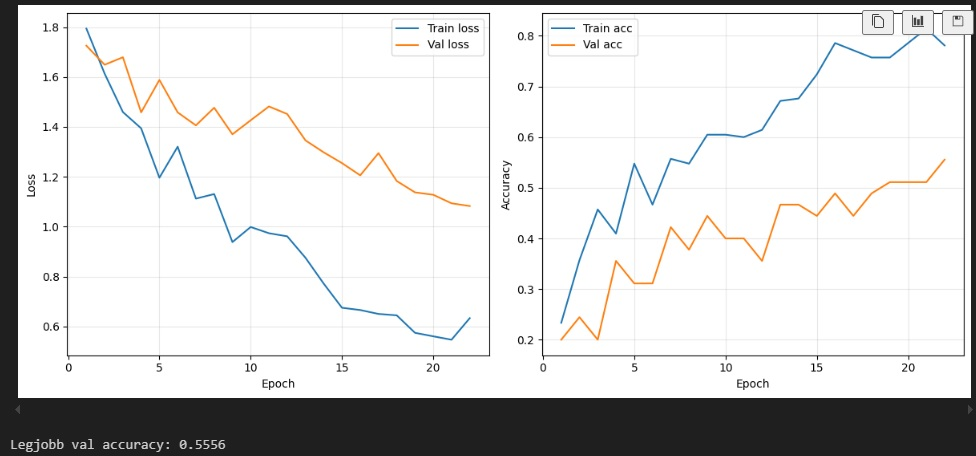
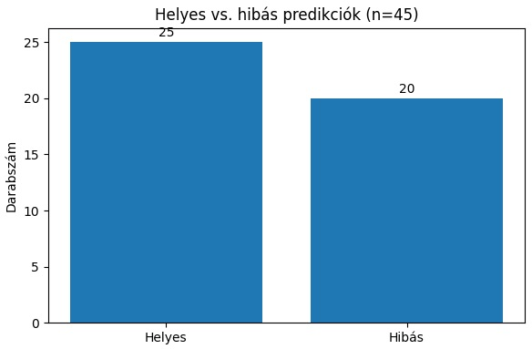
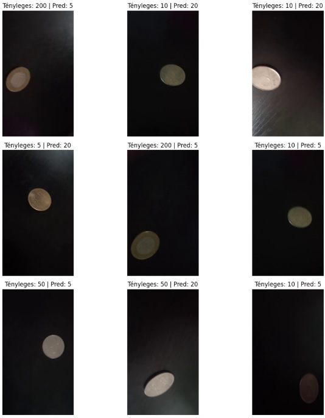

# Pénzérme-felismerés VGG16-tal (PyTorch)

Ez a projekt saját fotózott magyar forint érmék (5, 10, 20, 50, 100, 200 Ft) automatikus felismerését valósítja meg konvolúciós neurális hálóval. A modell alapja egy ImageNet-en előre betanított VGG16 háló, amelyre transfer learninget és finomhangolást (fine-tuning) alkalmazunk. Mivel a rendelkezésre álló adatmennyiség kicsi, erős data augmentationnel növeljük a tanítóhalmaz varianciáját. Az elkészült háló egy új érmefotó alapján megmondja, melyik címlet látható a képen. A projekt demonstrálja egy klasszikus CNN-alapú számítógépes látás pipeline teljes életciklusát adatelőkészítéstől az inferenciáig.

---

## Felhasznált technológiák

- Python, PyTorch, torchvision
- VGG16 konvolúciós neurális háló, transfer learning, fine-tuning
- Data augmentation: `RandomResizedCrop`, forgatás, horizontal/vertical flip, `ColorJitter`, opcionális `GaussianBlur`
- Train/val/test split, stratifikált osztás: `sklearn.model_selection.train_test_split`
- Tanulási ráta ütemező: `ReduceLROnPlateau` a validációs veszteség alapján
- Kiértékelés: teszt accuracy, `classification_report`, konfúziós mátrix (`sklearn.metrics`)

---

## Adatkészlet bemutatása

A nyers képek a `data_dir/` mappában találhatók. A fájlnevek egységes formátumot követnek, például: `5_forint_1.jpg`, `10_forint_23.jpg`, stb. A címke a fájlnévből kerül kiparszolásra a következőképpen: `label_name = base.split('_')[0]`, azaz az első aláhúzás előtti rész adja a címletet.

A modell 6 érmeosztályt különböztet meg:

- `['5', '10', '20', '50', '100', '200']`

Mindegyik címletből 50 db saját készítésű fotó áll rendelkezésre, így összesen 300 kép alkotja az adatkészletet. A képeket stratifikált módon osztjuk szét:

- Train: 70%
- Validáció (val): 15%
- Teszt: 15%

A stratifikált osztás biztosítja, hogy mindhárom halmazban hasonló osztályeloszlás legyen, és egyik címlet se legyen alul- vagy túlreprezentálva.

---

## Modell és tanítás rövid áttekintése

A modell alapja a `torchvision.models.vgg16`, amelyet ImageNet-en előre betanított súlyokkal (`VGG16_Weights.IMAGENET1K_V1`) töltünk be. A VGG16 feature extractor (konvolúciós rétegek) részét kezdetben befagyasztjuk, így az első szakaszban csak a fej (classifier) tanul. A classifier utolsó lineáris rétegét lecseréljük egy 6 kimenetű `nn.Linear` rétegre, hogy illeszkedjen a 6 érmeosztályhoz.

A tanítás két fázisban zajlik:

1. **Head-only tanítás**:
   - Csak a classifier rétegek tanulnak, a konvolúciós feature rétegek `requires_grad=False`.
   - Tanulási ráta: `head_lr` (pl. `1e-4`).
   - `stage1_epochs` számú epoch (pl. 12 epoch).

2. **Fine-tuning**:
   - Az utolsó konvolúciós blokkot feloldjuk (`unfreeze_last_conv_block`), így az adott blokk súlyai is taníthatóvá válnak.
   - A tanulási ráta nagyon kicsi (`finetune_lr`, pl. `1e-5`), hogy ne rontsuk el az előre betanított reprezentációt.
   - További `stage2_epochs` epoch (pl. 10 epoch) fut a finomhangolásra.

Mindkét fázisban `CrossEntropyLoss` a veszteségfüggvény, Adam optimalizálót használunk, és a tanulási rátát `ReduceLROnPlateau` scheduler szabályozza a validációs loss alapján. Minden epoch végén kiszámoljuk a train és val loss/accuracy értékeket, és a legjobb validációs pontosságot adó modell súlyait külön fájlba mentjük (`best_vgg16_coins.pth`).

---

## Data augmentation leírása

A tanító halmazra viszonylag erős, de nem túl agresszív augmentációt alkalmazunk, hogy a modell robusztusabb legyen a változó fényviszonyokra, pozíciókra és kisebb torzításokra:

- `RandomResizedCrop(224, scale=(0.8, 1.0))` – véletlen kivágás és átméretezés 224×224-re
- `RandomRotation(degrees=45)` – véletlen forgatás ±45°-ig
- `RandomHorizontalFlip()` és `RandomVerticalFlip()` – horizontális és vertikális tükrözés (érmék kör alakúak, ez jellemzően nem probléma)
- `ColorJitter(brightness=0.25, contrast=0.25, saturation=0.25)` – fényerő, kontraszt és szaturáció véletlen módosítása
- `RandomApply([GaussianBlur(kernel_size=3, sigma=(0.1, 1.0))], p=0.3)` – kis valószínűséggel enyhe elmosás
- `ToTensor()` – tenzorrá alakítás
- `Normalize(mean=imagenet_mean, std=imagenet_std)` – ImageNet statisztikákkal való normalizálás

A validációs és teszt halmazokra **nem** alkalmazunk ilyen véletlen transzformációkat, csak determinisztikus előfeldolgozást:

- `Resize((256, 256))` → `CenterCrop(224)`
- `ToTensor()`
- `Normalize(mean=imagenet_mean, std=imagenet_std)`

Ez biztosítja, hogy a kiértékelés „tiszta” legyen, és a metrikák valóban a modell általánosító képességét mérjék, ne az augmentáció szerencsés vagy szerencsétlen kombinációit.

---

## Eredmények és ábrák

A notebook a tanítás során elmenti a train és val loss/accuracy értékeket, valamint a legjobb validációs modellt. A konkrét teszt pontosság az adatok minőségétől és a beállításoktól függ; jelenleg a teszt-halmazon **kb. 55–60% pontosság** érhető el. A konfúziós mátrix alapján jól látszik, hogy a hasonló kinézetű címleteket keveri gyakrabban, míg másokat nagyobb biztonsággal felismer.

### Tanulási és validációs görbék



### Konfúziós mátrix


### Összesített helyes/hibás predikciók (mintavételes ellenőrzés)



### Hibás példák



---

## Használat – hogyan futtasd lokálisan

1. **Projekt letöltése / klónozása**
   - Töltsd le a projektet (pl. ZIP-ből vagy `git clone`-nal) egy tetszőleges könyvtárba.

2. **(Opcionális) virtuális környezet létrehozása**
   - Példa (Unix):
     ```bash
     python -m venv venv
     source venv/bin/activate
     ```
   - Példa (Windows):
     ```bash
     python -m venv venv
     venv\Scripts\activate
     ```

3. **Függőségek telepítése**
   - Ideális esetben:
     ```bash
     pip install -r requirements.txt
     ```
   - Vagy legalább a fő csomagok:
     ```bash
     pip install torch torchvision pandas scikit-learn matplotlib pillow
     ```

4. **Adatok előkészítése**
   - Hozd létre az `data_dir/` mappát a projekt gyökerében, és helyezd el benne a képeket a megadott névformátummal (pl. `5_forint_1.jpg`, `10_forint_23.jpg`, stb.).

5. **Notebook futtatása**
   - Indítsd el a Jupyter-t:
     ```bash
     jupyter notebook
     ```
   - Nyisd meg a `coin_classification_vgg16.ipynb` notebookot, és futtasd sorban a cellákat (adatbetöltés, tanítás, kiértékelés, inferencia).

6. **Hardver**
   - GPU (CUDA) erősen ajánlott a gyors tanításhoz, de a kód CPU-n is futtatható (csak lassabban). A notebook automatikusan detektálja, hogy elérhető-e CUDA (`device = 'cuda' if torch.cuda.is_available() else 'cpu'`).

---

## Inferencia – új kép előrejelzése

A notebook tartalmaz egy `predict_image` nevű segédfüggvényt, amellyel tetszőleges új érmefotó címletét lehet megbecsülni. A függvény:

1. Betölti az adott képet (PIL `Image.open`).
2. Ugyanazt a transzformációt alkalmazza, mint a teszt képeknél (`val_test_transform` – átméretezés, center crop, normalizálás).
3. Átfuttatja a modellt inferencia módban.
4. Softmax segítségével kiszámítja az osztályvalószínűségeket.
5. Visszaadja a legvalószínűbb érme címletet és a hozzá tartozó valószínűséget.

Példa használat és gyors tesztelés max. 100 véletlen tesztképen:

```python
def predict_image(model, image_path, transform, class_names):
    model.eval()
    image = Image.open(image_path).convert("RGB")
    tensor = transform(image).unsqueeze(0).to(device)
    with torch.no_grad():
        outputs = model(tensor)
        probs = torch.softmax(outputs, dim=1)
        conf, pred_idx = torch.max(probs, dim=1)
    pred_class = class_names[pred_idx.item()]
    return pred_class, conf.item()

# Véletlen mintákon gyors ellenőrzés
num_samples = min(100, len(test_df))
sample_df = test_df.sample(n=num_samples, random_state=SEED).reset_index(drop=True)

results = []
correct_count = 0
for _, row in sample_df.iterrows():
    img_path = row["path"]
    true_label = row["label_name"]
    pred_label, conf = predict_image(model, img_path, val_test_transform, class_names)
    is_correct = pred_label == true_label
    correct_count += int(is_correct)
    results.append({
        "path": img_path,
        "true_label": true_label,
        "pred_label": pred_label,
        "confidence": conf,
        "correct": is_correct,
    })

total = len(results)
incorrect_count = total - correct_count
print(f"Minták száma: {total}")
print(f"Helyes predikciók: {correct_count}")
print(f"Hibás predikciók:  {incorrect_count}")
print(f"Pontosság ezen a 100 mintán: {correct_count / total:.4f}")

results_df = pd.DataFrame(results)
display(results_df.head())

labels = ["Helyes", "Hibás"]
counts = [correct_count, incorrect_count]
plt.figure(figsize=(6, 4))
plt.bar(labels, counts)
plt.ylabel("Darabszám")
plt.title(f"Helyes vs. hibás predikciók (n={total})")
for i, v in enumerate(counts):
    plt.text(i, v + 0.5, str(v), ha="center")
plt.tight_layout()
plt.show()
```

A `pred_class` string formában adja vissza a címletet (pl. "100"), míg `conf` egy 0 és 1 közötti lebegőpontos érték, amely a modell becsült bizonyosságát jelzi. A fenti példa nemcsak egyedi képet becsül, hanem gyorsan ellenőrzi a modell teljesítményét legfeljebb 100 véletlen tesztmintán is, és vizuálisan megmutatja a helyes/hibás arányt.

---

## Összefoglaló

A projektben saját fotózott érmeadatbázist használtam, és a VGG16 előre tanított modelljére építve készítettem egy érmefelismerő rendszert. A kevés rendelkezésre álló kép miatt különböző augmentációs technikákat alkalmaztam (vágás, forgatás, tükrözés, fényerő–kontraszt módosítás, enyhe blur), hogy a modell minél többféle helyzetet megtanuljon kezelni. A legjobb modellt validáció alapján választottam ki, majd ezt használtam a teszteléshez; a hibás példák külön vizsgálata segített megérteni, mely címleteket keveri leginkább a háló. A jelenlegi végeredmény körülbelül 55–60% pontosság, ami a kis adatmennyiség és a hasonló kinézetű érmék miatt reális kiindulási pont.

A tanítást két lépésben végeztem: először csak a „fej” (classifier) tanult, majd az utolsó konvolúciós blokkot is feloldottam és nagyon kis tanulási rátával finomhangoltam, hogy jobban idomuljon az érmeképekre jellemző apró részletekhez. Végül külön függvényt készítettem az új képek osztályozására; a pipeline így lefedi az adat-előkészítést, augmentációt, transfer learninget, finomhangolást, kiértékelést és az inferenciát. További képek hozzáadásával és az augmentáció finomhangolásával a pontosság tovább javítható.
